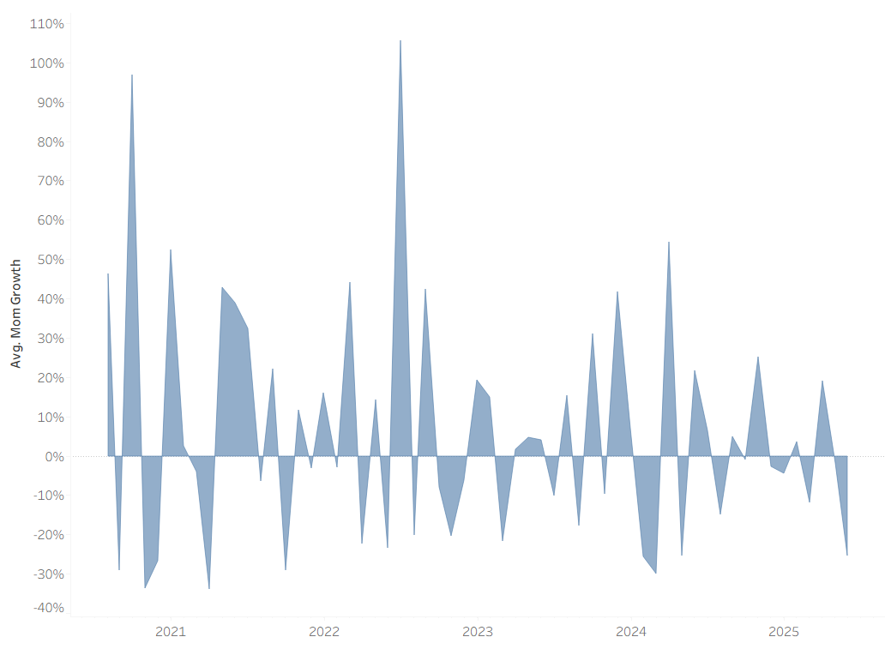
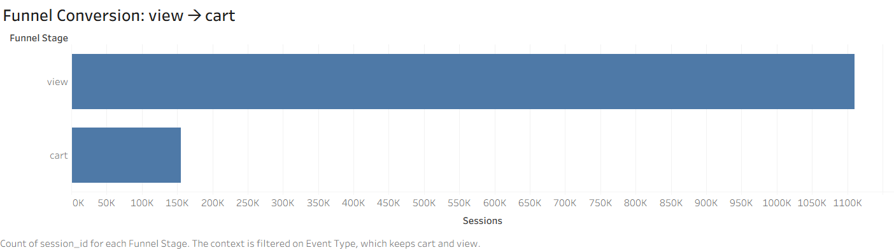
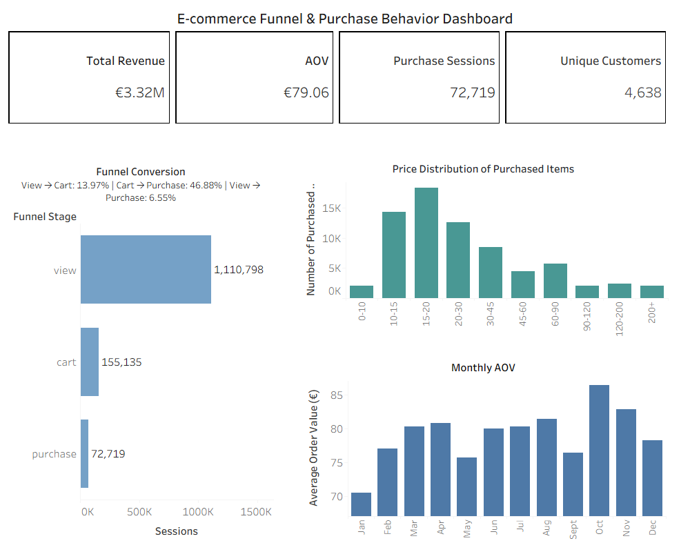

# E-commerce-Funnel-and-Customer-Behavior-Analysis
E-commerce funnel and customer behavior analysis using **SQL**, **Tableau** and **Python**

## Problem

The business needed to understand why users were browsing the catalog but not purchacing.

## Approach

I cleaned and normalized raw Shopify and sales data, calculated core purchase and funnel metrics, built **dashboards** of **KPI** metrics, and performed exploratory analysis to identify product discovery issues.

## Key Finding

The largest funnel drop was found at the view→cart stage (~14%), indicating friction at the product discovery step rather than at checkout.

## Next Step

This finding motivated the [further recommendation system project](https://github.com/Ichwour/Personalized-Recommendation-System-ML-Pipeline), focused on improving product selection through personalized candidate ranking.

## Data Extraction & Cleaning Demo

The raw Shopify export contained many technical and unstructured fields.  
Using **SQL**, I selected only the product attributes needed for customer behavior and sales analysis.

```sql
SELECT
    "Variant SKU" AS product_id,
    "Title" AS product_name,
    "Vendor" AS vendor,
    "Product Category" AS product_category,
    "Variant Price" AS product_price,
    "Variant Inventory Qty" AS inventory_qty,
    "Product Country (product.metafields.product.country)" AS country,
    "Product Region (product.metafields.product.region)" AS region,
    "Wine Sugar (product.metafields.wine.sugar)" AS sugar,
    "Wine Varietals (product.metafields.wine.varietals)" AS varietals,
    "Product Year (product.metafields.product.year)" AS product_year,
    "Wine Rating (product.metafields.wine.rating)" AS rating
FROM products
WHERE "Variant SKU" IS NOT NULL;
```
<br>
The next step was to connect sales history with product metadata and create an analysis-ready event table.

```sql
SELECT
    e."Client ID" AS client_id,
    e."Session ID" AS session_id,
    e."Date" AS event_time,
    e."Event Type" AS event_type,
    e.product_id,
    p.product_name,
    p.vendor,
    p.product_category,
    p.product_price,
    p.country,
    p.region,
    p.sugar,
    p.varietals,
    p.product_year,
    p.rating,
    e."Price" AS price
FROM events AS e
LEFT JOIN products AS p
    ON e.product_id = p.product_id;
```
    
After joining the datasets, I used **Python** and **pandas** to perform basic validation, clean missing and inconsistent values, standardize text fields, convert data types, and save the normalized analytical dataset.

```python
import pandas as pd

df = pd.read_csv("event_products.csv")
print(df.shape)
print(df.info())
print(df.isna().sum())
print(df.describe(include="all"))
key_cols = ["client_id", "session_id", "event_time", "event_type", "product_id", "price"]
df = df.dropna(subset=key_cols)
text_cols = ["event_type", "country", "region", "sugar", "varietals", "vendor"]

for col in text_cols:
    if col in df.columns:
        df[col] = (
            df[col]
            .astype(str)
            .str.strip()
            .str.lower()
            .replace({"nan": None, "": None})
        )

df["event_time"] = pd.to_datetime(df["event_time"], errors="coerce")
numeric_cols = ["product_price", "price", "product_year", "rating"]

for col in numeric_cols:
    if col in df.columns:
        df[col] = pd.to_numeric(df[col], errors="coerce")

df = df.dropna(subset=["event_time", "price"])
df.to_csv("data.csv", index=False)
print("Clean dataset saved:", df.shape)
```

## KPI Calculation

Using **SQL**, I calculated the main business metrics needed for funnel and purchase behavior analysis.  
The examples below show the calculation of Average Order Value (AOV) and session-level funnel conversion rates.

AOV was calculated from purchase events using item-level transaction prices.  
Since one session can contain multiple purchased products, order value was reconstructed by summing product prices within each purchase session.

```sql
SELECT
    AVG(order_sum) AS AOV
FROM (
    SELECT
        session_id,
        SUM(price) AS order_sum
    FROM data
    WHERE event_type = 'purchase'
    GROUP BY session_id
) t;
```

Funnel conversion rates were calculated at the session level using unique session identifiers for each stage of the user journey.

```sql
WITH counts AS (
    SELECT
        COUNT(DISTINCT CASE WHEN event_type = 'view' THEN session_id END) AS view_sessions,
        COUNT(DISTINCT CASE WHEN event_type = 'cart' THEN session_id END) AS cart_sessions,
        COUNT(DISTINCT CASE WHEN event_type = 'purchase' THEN session_id END) AS purchase_sessions
    FROM data
)
SELECT
    view_sessions,
    cart_sessions,
    purchase_sessions,
    cart_sessions * 1.0 / view_sessions AS view_to_cart,
    purchase_sessions * 1.0 / cart_sessions AS cart_to_purchase
FROM counts;
```

- view → cart: ~14%
- cart → purchase: ~47%
- AOV: ~79 euro

## Advanced Sales Analysis Using SQL Window Functions

To analyze temporal sales dynamics, I used **SQL window** functions to calculate month-over-month revenue growth.

```sql
WITH monthly_revenue AS (
    SELECT
        DATE_TRUNC('month', event_time) AS month,
        SUM(price) AS revenue
    FROM data
    WHERE event_type = 'purchase'
    GROUP BY DATE_TRUNC('month', event_time)
),

monthly_growth AS (
    SELECT
        month,
        revenue,
        LAG(revenue) OVER (ORDER BY month) AS prev_revenue
    FROM monthly_revenue
)

SELECT
    month,
    revenue,
    prev_revenue,
    (revenue - prev_revenue) * 1.0 / prev_revenue AS mom_growth
FROM monthly_growth
ORDER BY month;
```

## Dashboard

The cleaned dataset was visualized in **Tableau** to provide a business-facing overview of sales performance, customer behavior, and product demand.

Dashboard views include:
- Month-over-Month Revenue Growth
- Funnel conversion: view → cart
- Executive Tableau Dashboard including: complete Funnel conversion, monthly AOV trend, price distribution purchases

### Month-over-Month Revenue Growth



### Funnel Conversion view → cart



### Executive Tableau Dashboard

The final dashboard summarizes key e-commerce performance indicators, including total revenue, average order value, purchase sessions, unique customers, funnel conversion, monthly AOV dynamics, and the price distribution of purchased items.



All dashboards are available in the [`images`](images/) folder.

## Business Outcome

The analysis identified the main funnel bottleneck at the view→cart stage (~14% conversion).
This showed that the main issue was not checkout completion, but product discovery and selection.
Based on this insight, the next analytical direction was to improve product discovery through recommendation-based candidate selection.

## Recommendation System
Further analysis results were applied in a separate machine learning project focused on building a recommendation system to improve product discovery and selection:
[Personalized Recommendation System ML Pipeline](https://github.com/Ichwour/Personalized-Recommendation-System-ML-Pipeline)
